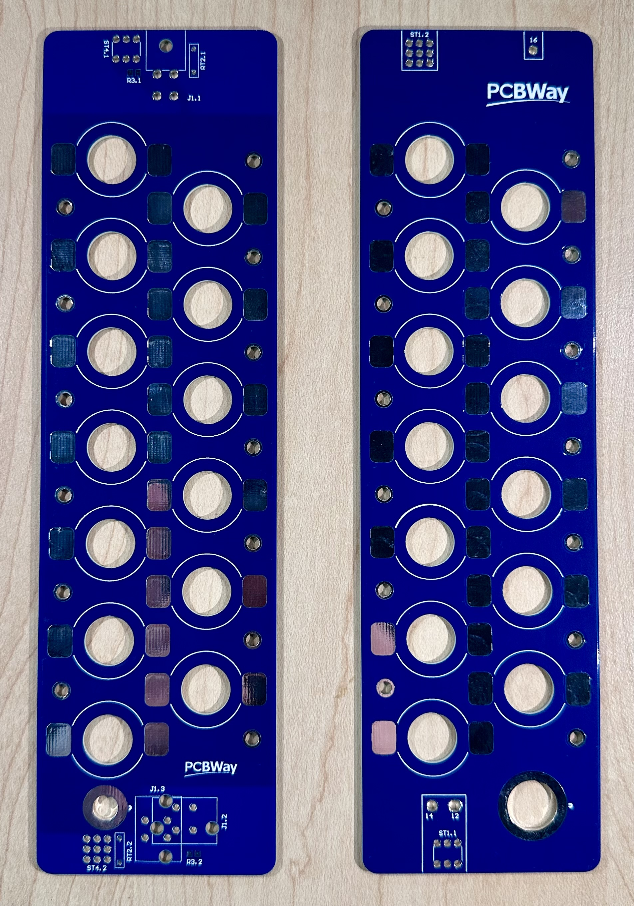

# Moduleboard Documentation - PCBWay Sponsored!
## Acknowledgment
This project was kindly supported by PCBWay, who manufactured the first batch of the moduleboard test PCBs! PCBWay provides reliable PCB manufacturing and assembly services, offering a wide range of cost-effective options for rapid prototyping and small-volume production.

    

**_Figure 1_:** Front view of positive and negative moduleboards, left and right respectively.

## Overview
The moduleboard is a PCB that serves as the primary electrical and mechanical interface between:
- Individual Li-ion cells connected to positive and negative moduleboards to produce a module-stack: 
- The moduleboard circuitry of the battery management system (BMS) which relays information to the Slaveboards

The Moduleboard circuitry has two overall purposes:
- Provides an interface for the slaveboards to measure voltage and temperature:
    - Moduleboard circuitry measures analog temperature using a thermistor, which the slaveboards use to generate a temperature value for the user
    - Moduleboard circuitry connects voltage sensing signals of B+ to the slaveboard, which converts the analog voltage (relative to GRND) across the module-stacks into a digital value for the user

## Design Goals & Requirements
The test-moduleboards were designed while considering scrutineering, accessibility, and system safety, with the following key objectives:
- Maintain accessibility to moduleboard components
- Be compatible with the new V4 battery-pack design, allowing easier integration between the Battery Management System and Battery Mechanical subteams
- Provide accurate cell voltage sensing through low-resistance, mechanically robust voltage tap connections.
- Have reliable and accurate cell temperature measurements by placing sensors as close as possible to the cells.
- Simplify assembly, servicing, and replacement of positive and negative moduleboards

## Moduleboard Topology
### Battery-Pack Architecture and Connections:
The battery pack consists of 32 module-stacks connected in series, with each module-stack composed of 13 lithium-ion cells connected in parallel. To monitor the pack, the battery management system (BMS) uses two Slaveboards, each responsible for 16 module-stacks (Slaveboard 1: module-stacks 1–16, Slaveboard 2: module-stacks 17–32). Each module-stack is the combination of a positive and a negative ModuleBoard. This defines the electrical endpoints of the stack (B+ and B-). 

The module-stacks are arranged in a zig-zag pattern throughout the battery pack due to the orientation of how the positive and negative moduleboards are connected to form a stack. To keep the moduleboard circuitry consistently at the top of the module stacks for accessibility consistent, the circuitry is mirrored at the top and bottom of the PCB’s.
 

    

**_Figure 2_:** Circuit Diagram of Battery-Pack and how it's module-stacks (positive and negative moduleboards) are interfacing with the Slaveboards.

    

**_Figure 3_:** Side view of three module-stacks (positive and negative moduleboards) connected in series. The zig-zag pattern occurs between module-stacks to optimize current flow through-out the pack between individual cells.

### Moduleboard Architecture and Connections:
Moduleboards are implemented to be complementary designs, corresponding to either end of a module-stack (positive or negative). The moduleboard:
- Routes LV signals to the Slaveboards through board-mounted connectors
- Hosts thermistor (temperature sensing component) close to the cells
- Provides access to B+ and B- of the modulestacks

The moduleboard does not directly measure voltage or temperature. It provides the slaveboards an interface for converting analog to digital signals. Each moduleboard interfaces with three primary system elements: the cells, adjacent moduleboards, and the BMS Slaveboards.

**Cell Interface:**\
The positive and negative moduleboards are spot-welded directly to the corresponding ends of the cells, hence making a module-stack. These connections establish B+ and B− electrical connections. They support both power routing through the Molex Sentralities and voltage sensing through voltage taps.

**BMS Interfaces:**\
Voltage and temperature LV signals are routed from the ModuleBoard to the Slaveboards via a 4-pin Molex connector. This connector serves as an interface for signals, including B+, Tsense, and GRND (required only for module-stacks 1 and 17) between the moduleboard and slaveboards. Component selection for thermistors, connectors, and B- to B+ connections are being evaluated to ensure continuity and accuracy for voltage and temperature measurements.

**Mechanical Interfaces:**\
Component placement is being evaluated to ensure mechanical robustness and serviceability. This includes connector placement and orientation, thermistor placement (and for the future, footprint sizing for different wire gauges of thermistor flexible leads), and B− to B+ connection methods (e.g., screw terminals, shank terminals, and right-angle screw terminals).

**_Voltage Sensing_**:
1. Cells create potential across module-stack: The module-stack has an electrical potential at its B+ terminal relative to the B- terminal.

2. Positive ModuleBoard circuitry connects to B+ through a trace, which routes the analog B+ signal to the moduleboard-to-Slaveboard connector. The connector carries the analog sense signal into the Slaveboard input.

3. The Slaveboard ADC measures the voltage relative to the Slaveboards internal reference (GRND from the slaveboards first module-stack) and converts the analog signal into a digital value. 

4. The Slaveboard computes the differential of the module-stack to get the module-stack voltage. 

5. The BMS will use this digital reading of the voltages across each module-stack for monitering and protection.

Note: Module-stack is 13 cells in parallel, the voltage reading represents the module-stack voltage (parallel cells share the same terminal voltage).

**Temperature Sensing:**
1. The thermistor is mounted on the moduleboard and positioned close to the cells.

2. On the Slaveboard-side, the thermistor connects to a fixed resistor to form a voltage divider. The Slaveboard supplies a reference voltage of 3V to complete the circuit for sensing. Additionally, the thermistor is connected to a capacitor in parallel to smooth out the Tsense voltage signal.

3. As temperature changes, the thermistor's resistance changes, causing the output voltage across the thermistor (Tsense) to change.

4. The ModuleBoard routes Tsense through the connector to the Slaveboard. The slaveboard ADC measures the analog Tsense voltage and converts it into a digital voltage value.

5. The slaveboard transmits the digital Tsense signal to the masterboard through a  galvanically isolated connection. The MCU’s firmware on the masterboard maps the resistance to a specific temperature using the thermistor’s data-sheet table. 

6. There is one thermistor per module-stack, so the BMS has module-level temperature readings to detect any abnormal behaviour.