# UBC Solar x PCBWay Sponsorship
Below are all the PCBs UBC Solar has sponsored with [**PCBWay**](https://www.pcbway.com/). PCBWay provides reliable PCB manufacturing and assembly services, offering a wide range of cost-effective options for rapid prototyping and small-volume production. [**PCBWay**](https://www.pcbway.com/) kindly supported all these project with manufacturing and design review! Please visit their site if you need PCB manufacturing or assembly services. There are lots of options for low-cost prototyping and small series production. Their 24/7 support for payments and for reviewing makes our teams production scale rapdiy!

# ↳ [Driver Dashboard Sponsored with PCBWay!](DRD.md)
The Driver Dashboard (DRD) is a PCB designed to act as the central hub of the interface between the driver and the solar racing car featuring LEDs, switches, and an LCD to display critical information of the car. This repository will go into details about the hardware design of this PCB from schematic to layout design. 

Additionally, this project was sponsored by [**PCBWay**](https://www.pcbway.com/), who provided PCB manufacturing support and quick design review for the DRD! During the review process, they clarified aspects of the layout and identified a design fault, which was confirmed and resolved prior to the board being produced.

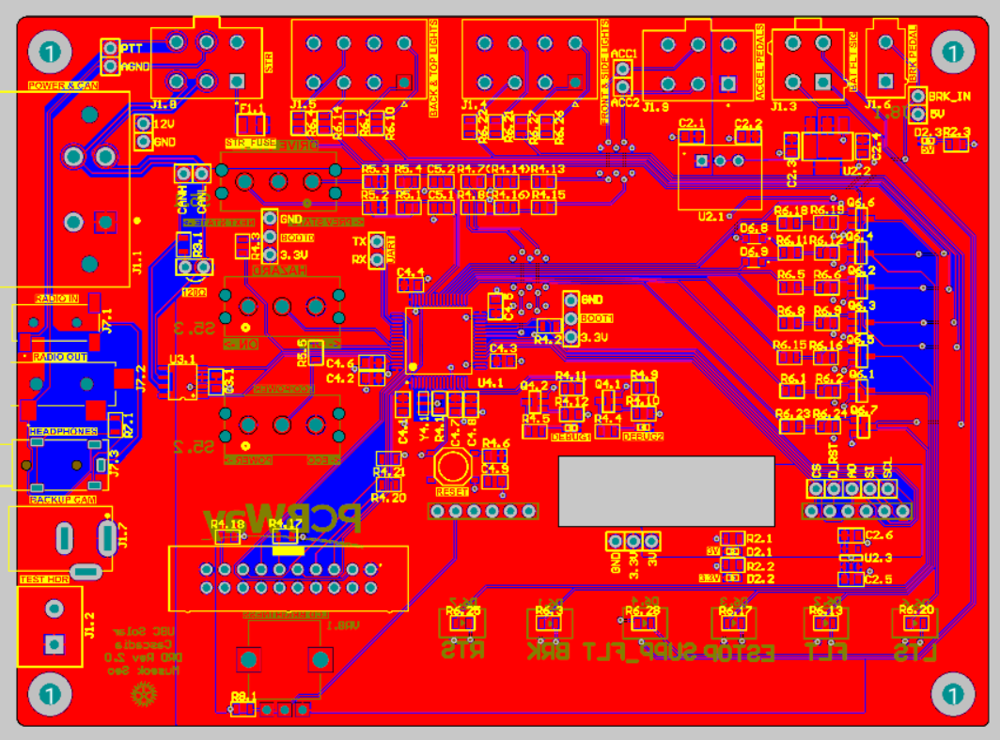

*Overall view of the Driver Dashboard (DRD) PCB.*

### Front Side
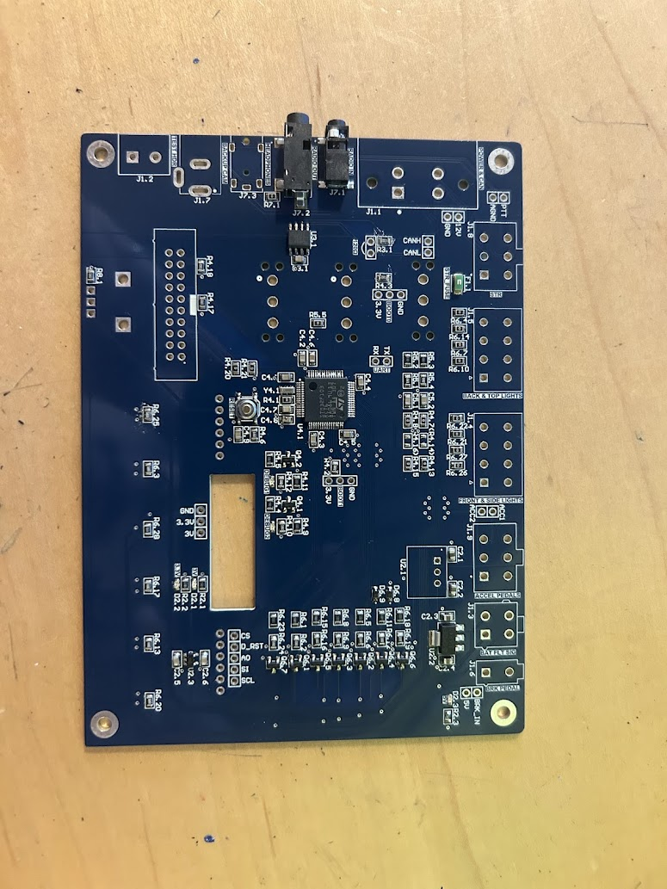 

*Front side of the DRD showing user interface components and signal routing.*

### Back Side

*Back side of the DRD highlighting power routing and ground plane coverage.*

## Project Overview

The DRD is controlled by an STM32F103RCT6 microcontroller responsible for managing 
* Low-voltage vehicle functions 
* Exterior lighting control of TruFlex Turn signals, fault, and hazard lights.
* Drive-state selection for park, reverse, and forward
* LCD Display for car vitals, speed, drive state, etc.

 The board interfaces with the vehicle CAN bus to receive real-time telemetry such as fault conditions, M2096 Mitsuba motor controller status signals, and the supplemental battery voltage, which are processed and displayed to the driver.

## Motor Control
Here is an example of the result of this board:

## Layout 

The DRD layout was driven by mechanical constraints and dashboard integration requirements, defining the placement of connectors, switches, and the display. Functional partitioning was used to group subsystems such as the Microcontroller Unit (MCU), CAN transceiver, and N-channel MOSFET LED drivers, to maximize the space usage of the board.

## Routing

With the various subsystems involving 30+ GPIOs, analog signals, and most importantly communication lines, various routing practices were used during this design process.

### Ground Plane Continuity
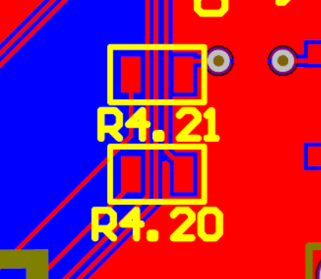

*0 Ω resistors used as signal jumpers to preserve ground plane continuity and short return paths.*

In order to prevent the GND plane being cut off by traces, 0 ohm resistors were used for some digital signals to bypass routes to create a continuous place for short return paths.

### Trace Geometry
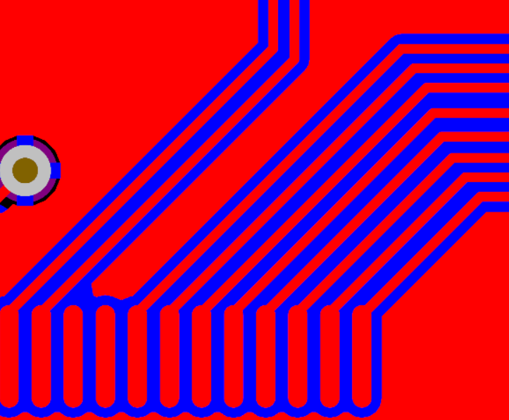

*Curved trace routing used to avoid abrupt geometry changes and maintain consistent signal behavior.*

Curved traces were used in place of 90-degree corners to avoid sudden changes in the geometry. An abrupt change will create a small area where the impedance will be decreased due to a larger area being present in the bend that causes slight impedance discontinuites in addition to minor reflections in fast signals.

### Ground Stitching Vias
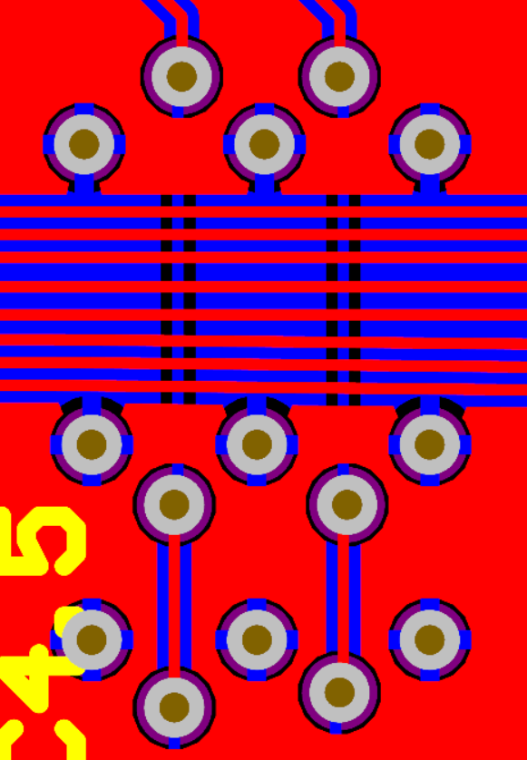

*Ground stitching vias used to reduce return path impedance and improve plane connectivity.*

Stiching vias were put in place as some traces switched between the planes due to hte large number of signals coming from the MCU. Stiching vias act as a stable reference for signals when they cross planes by having a continuous GND trace going from the top to bottom layer of the board that prevents magnetic coupling from the outside going to the inside.

### CAN Differential Pair Routing
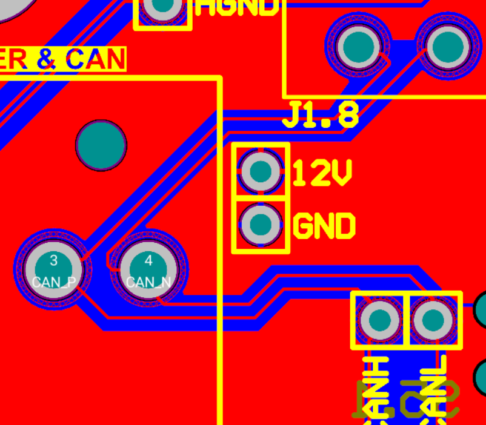

*CAN differential pair routing with consistent spacing and coupling to maintain noise immunity.*

CAN communication uses differential pair signaling, where a signal and its inverse are transmitted on a matched pair of traces such that external interference couples similarly into both lines. The receiver measures the voltage difference between the two signals, improving noise immunity by rejecting common-mode interference in the electrically noisy vehicle environment.

## Future Improvements

While the DRD integrates a large number of signals, future revisions would further refine component placement and routing to minimize signals crossing plane splits. Board area could also be optimized by tightening component spacing and reorganizing functional blocks, allowing the overall board length to be reduced.

# ↳ [Battery Module Board v1 Sponsored with PCBWay!](Moduleboard.md)

    

**_Figure 1_:** Front view of positive and negative moduleboards, left and right respectively.

## Overview
The moduleboard is a PCB that serves as the primary electrical and mechanical interface between:
- Individual Li-ion cells connected to positive and negative moduleboards to produce a module-stack: 
- The moduleboard circuitry of the battery management system (BMS) which relays information to the Slaveboards

The Moduleboard circuitry has two overall purposes:
- Provides an interface for the slaveboards to measure voltage and temperature:
    - Moduleboard circuitry measures analog temperature using a thermistor, which the slaveboards use to generate a temperature value for the user
    - Moduleboard circuitry connects voltage sensing signals of B+ to the slaveboard, which converts the analog voltage (relative to GRND) across the module-stacks into a digital value for the user

## Design Goals & Requirements
The test-moduleboards were designed while considering scrutineering, accessibility, and system safety, with the following key objectives:
- Maintain accessibility to moduleboard components
- Be compatible with the new V4 battery-pack design, allowing easier integration between the Battery Management System and Battery Mechanical subteams
- Provide accurate cell voltage sensing through low-resistance, mechanically robust voltage tap connections.
- Have reliable and accurate cell temperature measurements by placing sensors as close as possible to the cells.
- Simplify assembly, servicing, and replacement of positive and negative moduleboards

## Moduleboard Topology
### Battery-Pack Architecture and Connections:
The battery pack consists of 32 module-stacks connected in series, with each module-stack composed of 13 lithium-ion cells connected in parallel. To monitor the pack, the battery management system (BMS) uses two Slaveboards, each responsible for 16 module-stacks (Slaveboard 1: module-stacks 1–16, Slaveboard 2: module-stacks 17–32). Each module-stack is the combination of a positive and a negative ModuleBoard. This defines the electrical endpoints of the stack (B+ and B-). 

The module-stacks are arranged in a zig-zag pattern throughout the battery pack due to the orientation of how the positive and negative moduleboards are connected to form a stack. To keep the moduleboard circuitry consistently at the top of the module stacks for accessibility consistent, the circuitry is mirrored at the top and bottom of the PCB’s.
 

    

**_Figure 2_:** Circuit Diagram of Battery-Pack and how it's module-stacks (positive and negative moduleboards) are interfacing with the Slaveboards.

    

**_Figure 3_:** Side view of three module-stacks (positive and negative moduleboards) connected in series. The zig-zag pattern occurs between module-stacks to optimize current flow through-out the pack between individual cells.

### Moduleboard Architecture and Connections:
Moduleboards are implemented to be complementary designs, corresponding to either end of a module-stack (positive or negative). The moduleboard:
- Routes LV signals to the Slaveboards through board-mounted connectors
- Hosts thermistor (temperature sensing component) close to the cells
- Provides access to B+ and B- of the modulestacks

The moduleboard does not directly measure voltage or temperature. It provides the slaveboards an interface for converting analog to digital signals. Each moduleboard interfaces with three primary system elements: the cells, adjacent moduleboards, and the BMS Slaveboards.

**Cell Interface:**\
The positive and negative moduleboards are spot-welded directly to the corresponding ends of the cells, hence making a module-stack. These connections establish B+ and B− electrical connections. They support both power routing through the Molex Sentralities and voltage sensing through voltage taps.

**BMS Interfaces:**\
Voltage and temperature LV signals are routed from the ModuleBoard to the Slaveboards via a 4-pin Molex connector. This connector serves as an interface for signals, including B+, Tsense, and GRND (required only for module-stacks 1 and 17) between the moduleboard and slaveboards. Component selection for thermistors, connectors, and B- to B+ connections are being evaluated to ensure continuity and accuracy for voltage and temperature measurements.

**Mechanical Interfaces:**\
Component placement is being evaluated to ensure mechanical robustness and serviceability. This includes connector placement and orientation, thermistor placement (and for the future, footprint sizing for different wire gauges of thermistor flexible leads), and B− to B+ connection methods (e.g., screw terminals, shank terminals, and right-angle screw terminals).

**_Voltage Sensing_**:
1. Cells create potential across module-stack: The module-stack has an electrical potential at its B+ terminal relative to the B- terminal.

2. Positive ModuleBoard circuitry connects to B+ through a trace, which routes the analog B+ signal to the moduleboard-to-Slaveboard connector. The connector carries the analog sense signal into the Slaveboard input.

3. The Slaveboard ADC measures the voltage relative to the Slaveboards internal reference (GRND from the slaveboards first module-stack) and converts the analog signal into a digital value. 

4. The Slaveboard computes the differential of the module-stack to get the module-stack voltage. 

5. The BMS will use this digital reading of the voltages across each module-stack for monitering and protection.

Note: Module-stack is 13 cells in parallel, the voltage reading represents the module-stack voltage (parallel cells share the same terminal voltage).

**Temperature Sensing:**
1. The thermistor is mounted on the moduleboard and positioned close to the cells.

2. On the Slaveboard-side, the thermistor connects to a fixed resistor to form a voltage divider. The Slaveboard supplies a reference voltage of 3V to complete the circuit for sensing. Additionally, the thermistor is connected to a capacitor in parallel to smooth out the Tsense voltage signal.

3. As temperature changes, the thermistor's resistance changes, causing the output voltage across the thermistor (Tsense) to change.

4. The ModuleBoard routes Tsense through the connector to the Slaveboard. The slaveboard ADC measures the analog Tsense voltage and converts it into a digital voltage value.

5. The slaveboard transmits the digital Tsense signal to the masterboard through a  galvanically isolated connection. The MCU’s firmware on the masterboard maps the resistance to a specific temperature using the thermistor’s data-sheet table. 

6. There is one thermistor per module-stack, so the BMS has module-level temperature readings to detect any abnormal behaviour.

# ↳ [Battery Module Board v2 Sponsored with PCBWay!](Moduleboard_Iteration_2.md)
## Overview
Iteration 2 of the Moduleboard builds directly upon [Moduleboard Iteration 1](Moduleboard.md). The overall electrical topology and system architecture remain fundamentally the same as Iteration 1. The board continues to serve as the electrical and mechanical interface between:

- Individual Li-ion cells forming module-stacks
- The Battery Management System (BMS) Slaveboards responsible for voltage and temperature monitoring

---

## Purpose of Iteration 2
The goals of Iteration 2 are:

- Make improvements to **component layout and PCB routing**
- Improve **mechanical integration with the V4 battery pack design (working with Battery Mechanical Team)**
- Test **connector orientation with wire bending --> improve wire routing throughout pack**
- Finalize **thermistor**

While the **core circuitry remains unchanged**, this iteration allows the team to experimentally verify layout and component decisions before committing to a finalized design.

---

## Summary of Changes from Iteration 1

This section summarizes the primary differences between Iteration 1 and Iteration 2.

### Electrical Design
- Core sensing architecture remains unchanged
- Voltage sensing topology identical to Iteration 1
- Thermistor sensing interface unchanged
- Connector pinout remains the same

### PCB Changes
- Replaced Screw/Shank Terminals with through-hole soldered wire (with plastic-bonder) --> Testing 3 different wire guages: 20, 22, 24 AWG
- Placed Connector in the middle of the PCB, with Battery Management System (BMS) circuitry tightly packed
- Thermistor footprint reduced for 24 AWG wire
- Large plated through-holes for metal rod that goes through module-stacks for mechanical support

Iteration 2 boards will be used to evaluate the following aspects of the design:

### Electrical Validation
- Accuracy of thermistors
- Connector reliability and wire bend

### Mechanical Validation
- Robustness of B- to B+ Connection using new method
- Compatibility with the V4 battery pack structure
- Accessibility of connectors during assembly
- Robustness of thermistor mounting

### Assembly Validation
- Ease of installing BMS components onto moduleboards
- Overall assembly workflow

---

## Future Iterations

Based on the results of testing with Iteration 2 boards, I will be:

- Updating PCB with finalized component placements
- Idiot proofing connections
- Optimize routing for production
- Finalizing thermistors and the thermistor mounting method

The results from this revision have helped me developed the **next finalized version of the Moduleboard** used in the full battery pack.

# ↳ [Masterboard Sponsored with PCBWay!](MST.md)
The Masterboard (MST) is a crucial PCB designed for the UBC Solar V4 battery pack, acting as the primary Battery Management System (BMS) interface. This page details the hardware design and functional implementation of the Masterboard.

This project was generously sponsored by [**PCBWay**](https://www.pcbway.com/), who provided manufacturing support for the Masterboard!

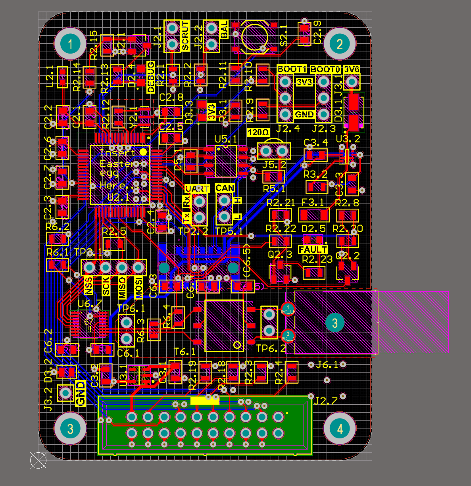

*Overall view of the Masterboard (MST) PCB.*

### Front Side
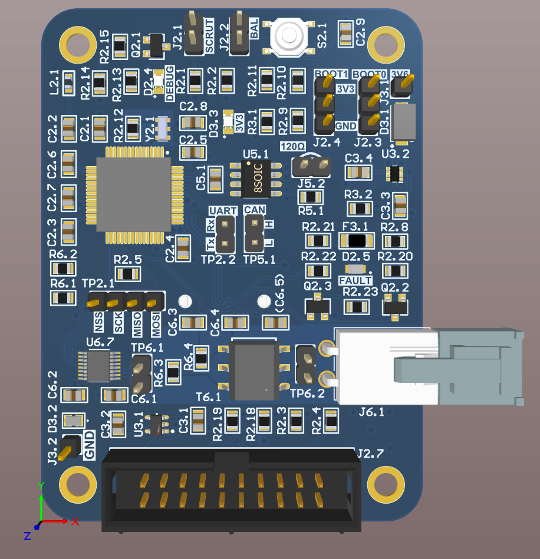

*Front side of the MST highlighting routing and primary components.*

## Project Overview

The Masterboard is the brain of the battery management system, controlled by an STM32F103RCT6 microcontroller. The board manages:
* **Cell Monitoring:** Gathering per-module voltage and temperature from slaveboards.
* **Vehicle Safety:** Directly enabling or disabling contactors in case of emergencies or faults by asserting HLIM and LLIM open.
* **Communication:** Utilizing CAN interface to establish communication with the High Voltage Controller (HVC).
* **Thermal Management:** Passing Fan PWM signals through the HVC to control battery cooling fans.
* **Status Reporting:** Monitoring supplemental battery voltage, estop, overcurrent, and issuing fault/warning statuses.

## Technical Features

### IsoSPI Communication

The Masterboard interfaces with the battery slaveboards using an isolated SPI (IsoSPI) interface powered by an LTC6820 transceiver. This allows robust, fault-tolerant communication between the master and slave devices within the electrically noisy environment of the battery pack.

### Safety and Contactor Control

The MST constantly monitors cell voltages and temperatures. If any module exceeds safe operating limits (e.g., undervoltage, overvoltage, or overtemperature), the Masterboard can directly control the High Limit (HLIM) and Low Limit (LLIM) signals to open the contactors, isolating the battery pack and ensuring vehicle safety.

### System Diagnostics

The board includes comprehensive startup and continuous checks, such as testing the ability to communicate, checking for open voltage tap wires, and monitoring the ADBMS chip temperature, providing a reliable and safe operating state for the battery pack.

## Design Goals & Requirements

The V4 Masterboard was developed starting from scratch to revisit the entire design and ensure high reliability:
* **Noise Immunity:** Proper grounding and layout practices to minimize EMI from the battery pack.
* **Component Selection:** Utilizing automotive-grade or highly reliable components like the TCAN332DR CAN transceiver and STM32 MCU.
* **Continuous Monitoring:** Checking voltage taps and communication at regular intervals to prevent silent failures.

## Future Improvements

Future iterations will focus on further optimizing the firmware structure and incorporating more advanced self-tests. Additional telemetry and refined debugging builds will help the pit crew quickly diagnose issues during races.

# ↳ [High Voltage Controller ⚡ with PCBWay!](Moduleboard.md)
The High Voltage Controller (HVC) is a critical PCB designed for the UBC Solar V4 battery pack, acting as the primary control and safety interface for the vehicle's high-voltage systems. This page details the hardware design, from schematic architecture to functional implementation.

[**PCBWay**](https://www.pcbway.com/) lindly supported this project with manufacturing support and design review for the HVC! Please visit their site if you need PCB manufacturing or assembly services. There are lots of options for low-cost prototyping and small series production. Their 24/7 support for payments and for reviewing makes our teams production scale rapdiy!

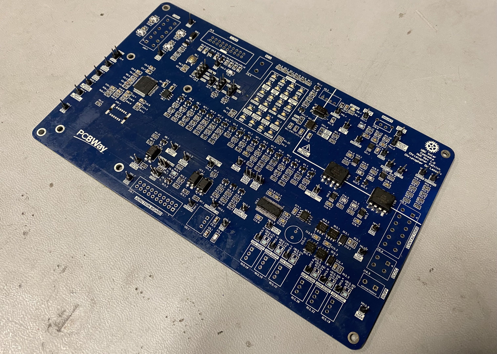
*Overall view of the High Voltage Controller (HVC) PCB.*

## Project Overview

The HVC is responsible for the finite state machine of the battery pack and controls power for all other systems in the car. Controlled by an STM32 microcontroller, the board manages:
* **Contactor Control:** Toggling the ground of the LLIM, HLIM, POS, and NEG contactor coils.
* **Power Path Prioritization:** Switching between a 12V DCDC converter and supplemental battery power using an LTC4421 prioritizer.
* **Precharge & Discharge:** Managing high-voltage precharge for the motor and MPPTs, alongside discharge relay control.
* **Current Sensing:** Isolated high-side current sensing using an INA228 and isolated DCDC power.
* **Vehicle Safety:** Integrating E-Stop level shifting and hardware-based current faulting.

## Technical Features

### Contactor Control System

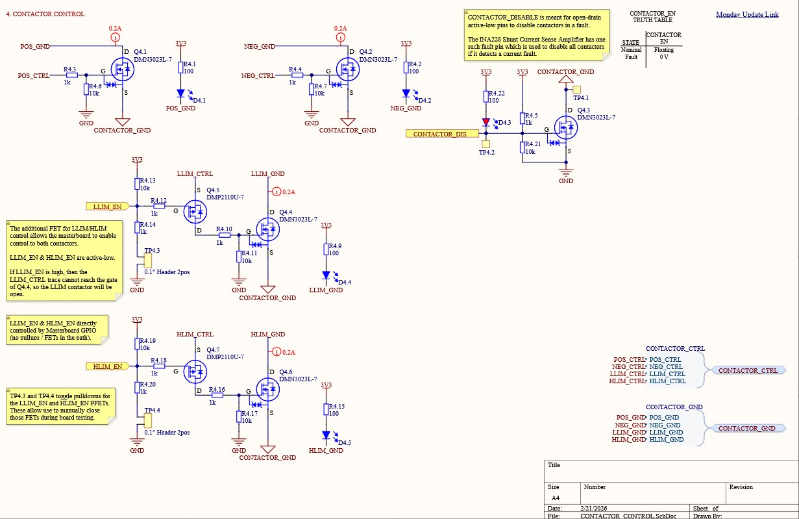
*NFET circuit for low-side contactor coil switching.*

The HVC controls the state of high-power contactors through low-side switching. When the associated N-Channel MOSFET is closed, the contactor coil's negative terminal is connected to the ECU's ground, allowing current to flow and closing the armature. To protect components from inductive back-EMF, each circuit includes a flyback diode between the negative contact and the high-side control line.

### Power Path Prioritizer

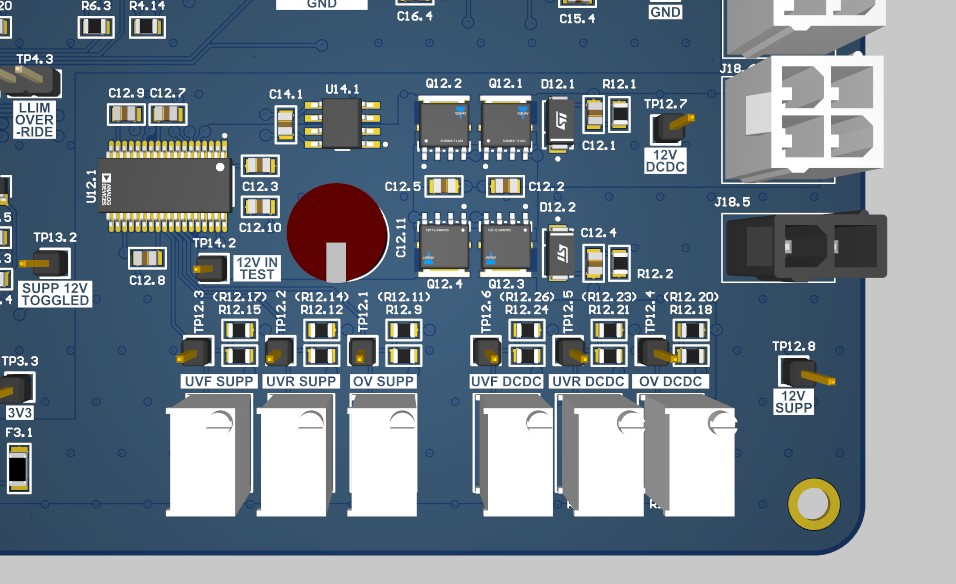
*The Power Path Prioritizer chooses between the supplemental battery and the DCDC converter.*

The board utilizes an LTC4421 Power Path Prioritizer to manage dual 12V inputs. This allows the car to switch between the main DCDC converter and the supplemental battery without power interruption. The system is configured to retry connections automatically after an over-current fault to ensure continuous vehicle operation where possible.

### Isolated Current Sensing

Because the shunt resistor inputs interface directly with high voltage, they are galvanically isolated from the rest of the HVC. This is achieved using a NEK0303SC isolated DCDC converter, which provides isolated 3.3V power to the sensing circuitry. As a design redundancy, the board also includes backup circuitry for a Hall Effect current sensor and a 1.8V reference.

## Design Goals & Requirements

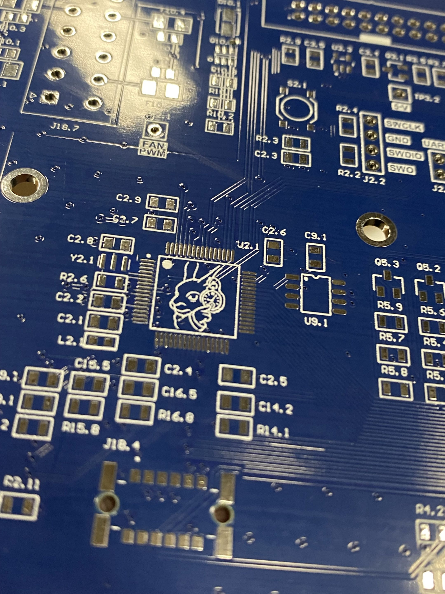
*PCB Art is a requirement.*

The HVC was developed with a focus on system reliability and compliance with solar car scrutineering standards:
* **Safety Isolation:** Maintaining strict isolation between high-voltage sensing points and low-voltage control logic.
* **Monitoring:** Real-time monitoring of precharge states and voltage levels across all high-voltage inputs.
* **Organization:** Utilizing a hierarchical schematic design for clarity, with dedicated blocks for power, MCU, and specialized control circuits.

## Future Improvements

Future iterations will focus on usability and reliability of the HVC. This will streamline UBC Solar's ability to debug the HVC at critical moments during testing and competition, and ensure the HVC can be easily serviced if needed.

